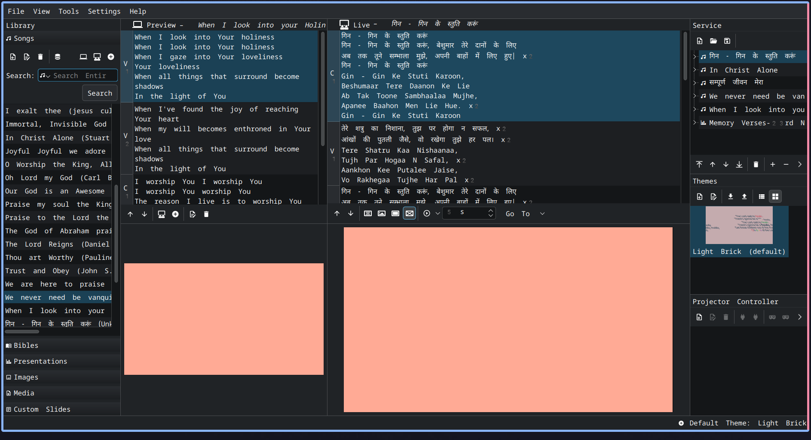

# Delhi - Noida CFC songs openlp database

## Installation instructions

- Open OpenLP 
- Go to Tools > Open Data Folder
- In the folder open the `songs` folder
- save the existing `songs.sqlite` file as a backup (something like `songs.sqlite.bak`)
- copy the `songs.sqlite` in this repository to the data/songs folder
- Restart OpenLP
